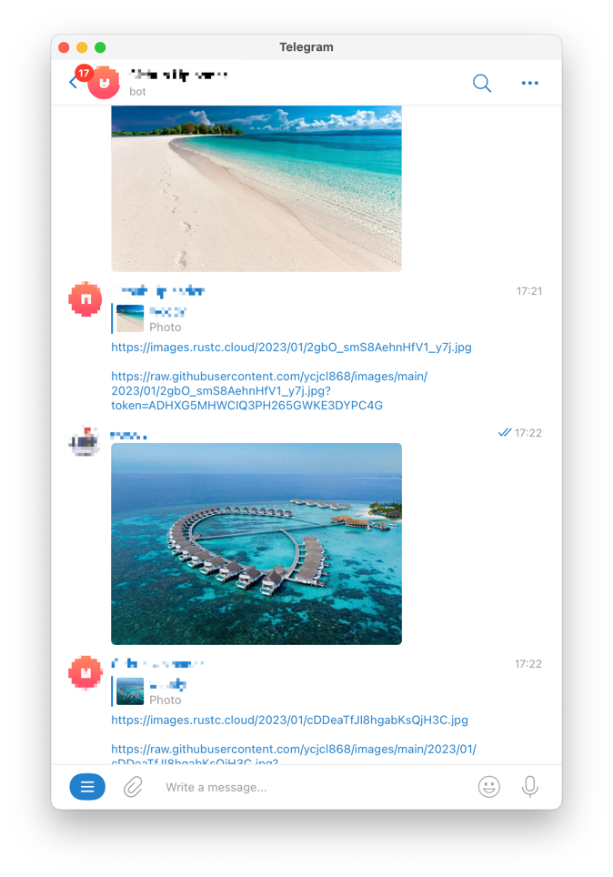

<h1 align="center">Telegram Image Uploader Bot</h1>
<p align="center">desc<p>

## Screenshots



- [https://images.rustc.cloud/2023/01/cDDeaTfJl8hgabKsQjH3C.jpg](https://images.rustc.cloud/2023/01/cDDeaTfJl8hgabKsQjH3C.jpg)
- [https://images.rustc.cloud/2023/01/kS9DG46LANQzKXOgD7rtT.jpg](https://images.rustc.cloud/2023/01/kS9DG46LANQzKXOgD7rtT.jpg)

## Environment

```bash
GITHUB_TOKEN=
TELEGRAM_BOT_TOKEN=
IMG_HOST=    # eg https://images.rustc.cloud
GITHUB_REPO= # eg ycjcl868/images
```

## Available Commands

In the project directory, you can run:

### `/foo`,

The app is built using `create-react-app` so this command Runs the app in Development mode. Open [http://localhost:3000](http://localhost:3000) to view it in the browser. You also need to run the server file as well to completely run the app. The page will reload if you make edits.
You will also see any lint errors in the console.

## Built With

- Golang
- Telegram API
- Vercel

## Future Updates

- [ ] Github App
- [ ] Support gif upload

## 🤝 Support

Contributions, issues, and feature requests are welcome!

Give a ⭐️ if you like this project!


## Reference

- [Telegram Bot API](https://core.telegram.org/bots/api#available-methods)
- [go-telegram-bot-api/telegram-bot-api](https://github.com/go-telegram-bot-api/telegram-bot-api)
- [Build a serverless Telegram chatbot deployed using Vercel](https://www.marclittlemore.com/serverless-telegram-chatbot-vercel/)
- [在 Vercel 优雅地搭建 Go 微服务](https://sorcererxw.com/articles/vercel-go-microservice)
